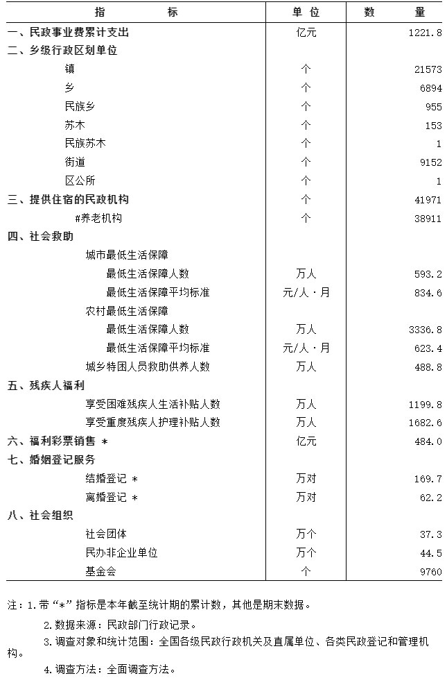

# 民政统计数据表（第三、四、五、七项）

| 指标 | 单位 | 数量 |
| :--- | :---: | :---: |
| **三、提供住宿的民政机构** | 个 | 41971 |
| 　　#养老机构 | 个 | 38911 |
| **四、社会救助** | | |
| 　　城市最低生活保障 | | |
| 　　　　最低生活保障人数 | 万人 | 593.2 |
| 　　　　最低生活保障平均标准 | 元/人·月 | 834.6 |
| 　　农村最低生活保障 | | |
| 　　　　最低生活保障人数 | 万人 | 3336.8 |
| 　　　　最低生活保障平均标准 | 元/人·月 | 623.4 |
| 　　城乡特困人员救助供养人数 | 万人 | 488.8 |
| **五、残疾人福利** | | |
| 　　享受困难残疾人生活补贴人数 | 万人 | 1199.8 |
| 　　享受重度残疾人护理补贴人数 | 万人 | 1682.6 |
| **七、婚姻登记服务** | | |
| 　　结婚登记 * | 万对 | 169.7 |
| 　　离婚登记 * | 万对 | 62.2 |

---

# 官方数据

